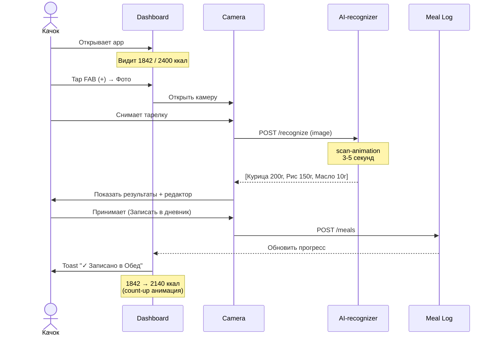
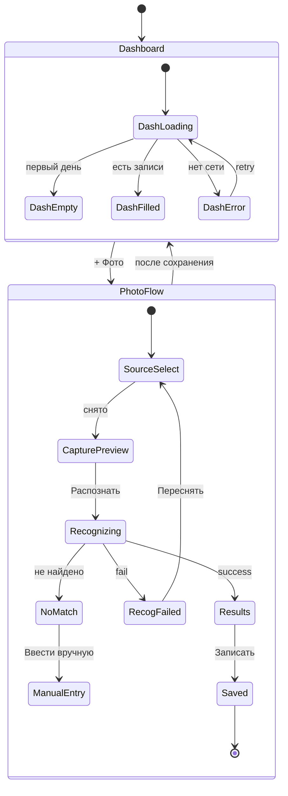
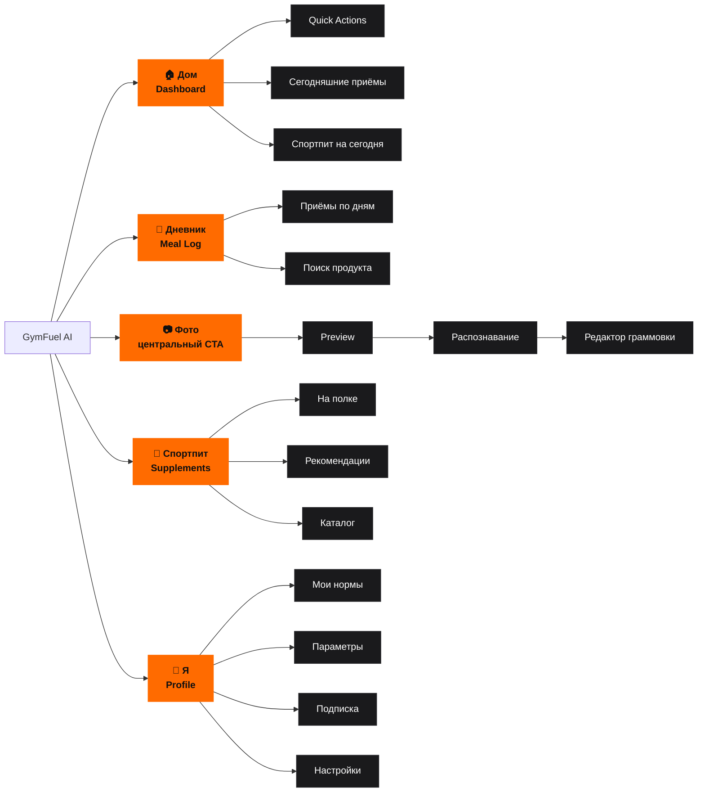

# GymFuel AI — Главный пользовательский флоу

**Проект:** AI-счётчик калорий и спортпита для качков
**Форм-фактор:** PWA (mobile-first)
**Документ:** карта навигации MVP

---

## 1. End-to-end флоу (новый пользователь → запись приёма пищи)

```mermaid
flowchart TD
    Start([Пользователь открывает PWA]) --> Splash[Splash / Login]

    Splash -->|Войти через Google/Apple/Email| Auth{Есть аккаунт?}
    Auth -->|Нет| OB1[Онбординг шаг 1:<br/>Пол и возраст]
    Auth -->|Да| Dashboard

    OB1 --> OB2[Шаг 2:<br/>Рост и вес]
    OB2 --> OB3[Шаг 3:<br/>Цель: масса / сушка / поддержка]
    OB3 --> OB4[Шаг 4:<br/>Уровень активности]
    OB4 --> OB5[Шаг 5:<br/>Спортпит на полке]
    OB5 --> Calc[/🔥 Расчёт норм.../]
    Calc --> Norms[Твои нормы:<br/>Ккал · Б · У · Ж]
    Norms -->|Поехали| Dashboard

    Dashboard[🏠 Dashboard<br/>метрики дня + приёмы]

    Dashboard -->|Tap FAB +| ActionSheet{Как записать?}
    Dashboard -->|Tab 'Фото'| PhotoSource
    Dashboard -->|Tab 'Дневник'| MealLog
    Dashboard -->|Tab 'Спортпит'| Supplements
    Dashboard -->|Tab 'Я'| Profile

    ActionSheet -->|📸 Фото| PhotoSource
    ActionSheet -->|🔍 Поиск| Search
    ActionSheet -->|🎤 Голос| Voice[/disabled: Скоро/]

    PhotoSource{Источник фото}
    PhotoSource -->|Снять сейчас| Camera[📸 Камера / захват]
    PhotoSource -->|Из галереи| Picker[Выбор из галереи]

    Camera --> Preview[Preview фото]
    Picker --> Preview
    Preview -->|Переснять| PhotoSource
    Preview -->|✨ Распознать| Loading[/Распознаю.../<br/>scan-animation 3-5s]

    Loading -->|success| Result[Результаты:<br/>список продуктов + КБЖУ]
    Loading -->|fail| RecogError[❌ Не получилось.<br/>Переснять / Ввести руками]
    RecogError -->|Переснять| PhotoSource
    RecogError -->|Руками| Search

    Result -->|Редактировать граммы| Result
    Result -->|+ Добавить вручную| Search
    Result -->|Выбрать приём: Завтрак/Обед/...| Result
    Result -->|Записать в дневник| Save[/Сохранение/]
    Save --> Toast[✓ Записано в Обед]
    Toast --> Dashboard

    Search[🔍 Поиск продукта<br/>autocomplete + избранное]
    Search -->|Выбрать продукт| EditGrams[Граммовка + приём пищи]
    EditGrams -->|Записать| Save

    MealLog[📖 Meal Log<br/>все приёмы за день]
    MealLog -->|Свайп по дням| MealLog
    MealLog -->|Tap на приём| EditMeal[Редактировать приём]
    MealLog -->|FAB +| ActionSheet
    EditMeal --> MealLog

    Supplements[💊 Спортпит<br/>На полке / Рекомендации]
    Supplements -->|Принял| Save
    Supplements -->|+ Добавить| AddSupp[Выбор добавки]
    AddSupp --> Supplements

    Profile[👤 Профиль]
    Profile -->|Пересчитать нормы| OB3

    classDef primary fill:#FF6B00,stroke:#FF6B00,color:#0F0F10,font-weight:bold
    classDef screen fill:#1A1A1C,stroke:#2A2A2E,color:#FFFFFF
    classDef success fill:#6BCB77,stroke:#6BCB77,color:#0F0F10
    classDef error fill:#E5484D,stroke:#E5484D,color:#FFFFFF
    classDef process fill:#242428,stroke:#2A2A2E,color:#B8B8BE,font-style:italic

    class Start,Splash primary
    class OB1,OB2,OB3,OB4,OB5,Dashboard,PhotoSource,Camera,Picker,Preview,Result,Search,EditGrams,MealLog,EditMeal,Supplements,AddSupp,Profile,Norms screen
    class Toast success
    class RecogError error
    class Calc,Loading,Save,Voice process
```

---

## 2. Ключевой happy-path (3 тапа до записи)



---

## 3. Состояния экранов (error / empty / loading)



---

## 4. Навигационная иерархия (5 табов)



---

## 5. Метрики флоу (целевые)

| Путь | Тапов | Время | Приоритет |
|------|-------|-------|-----------|
| Onboarding (новый юзер) | 6 | ~90 сек | High |
| Dashboard → Фото → Записать | **3** | ~8 сек | **CRITICAL** |
| Dashboard → Поиск → Записать | 4 | ~15 сек | High |
| Dashboard → Спортпит → Принял | 3 | ~5 сек | Medium |
| Профиль → Пересчитать нормы | 3 | ~20 сек | Low |

**Главный KPI UX:** Dashboard → запись приёма пищи ≤ 3 тапа (см. Design Principle P3 из ТЗ).

---

## Связанные документы
- `03_ТЗ_дизайн_приложения.md` — полная спецификация экранов (раздел 5–6)
- `Dashboard.tsx` — React-реализация главного экрана
- `PhotoRecognition.tsx` — три состояния флоу распознавания
- `preview.html` — статичный визуальный референс Dashboard
